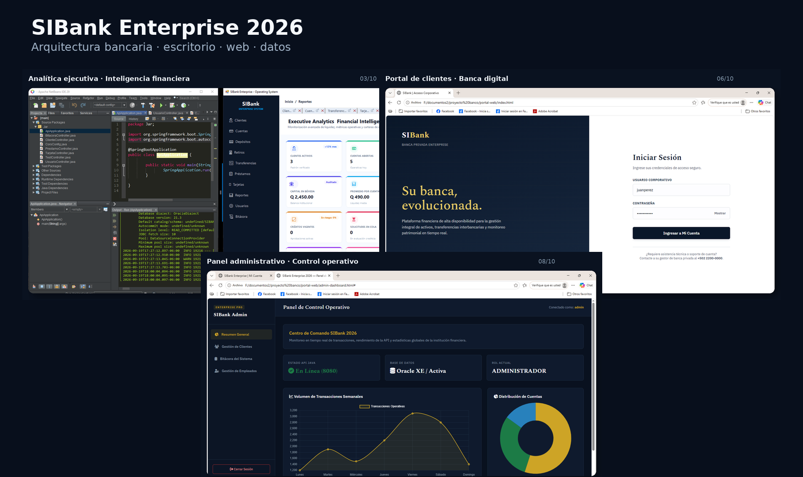
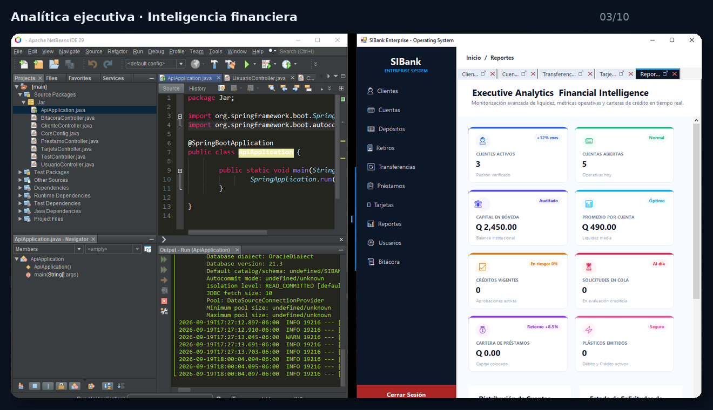
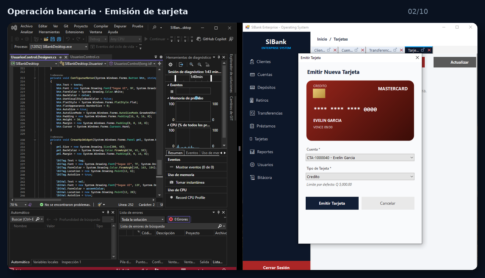
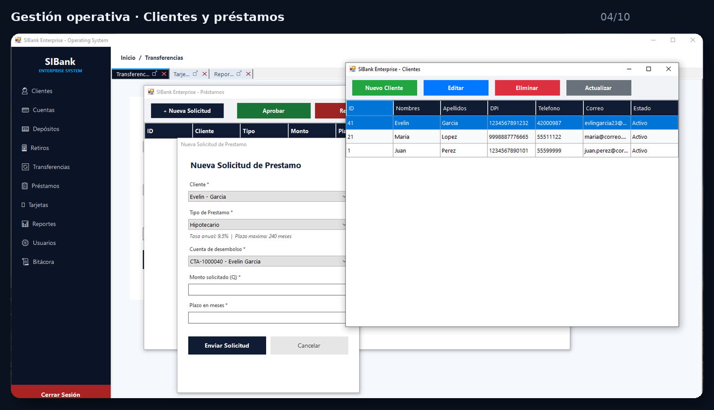
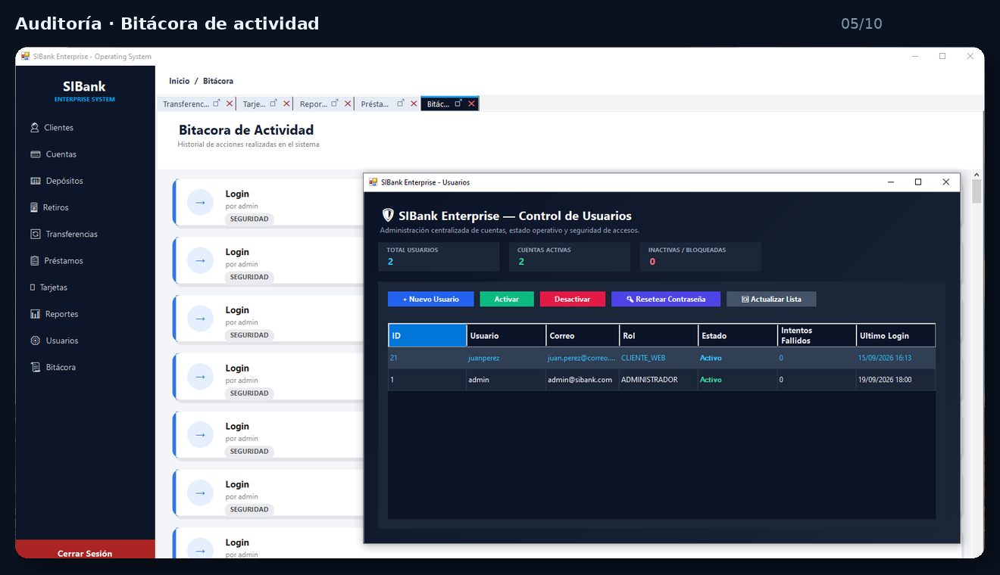
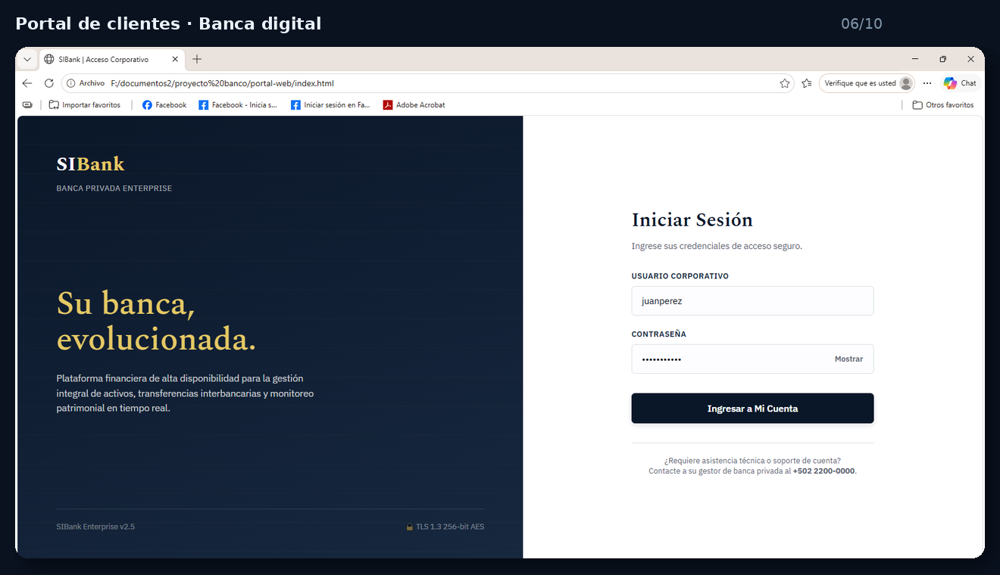
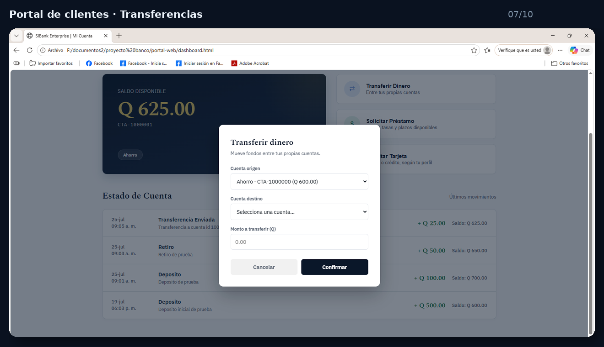
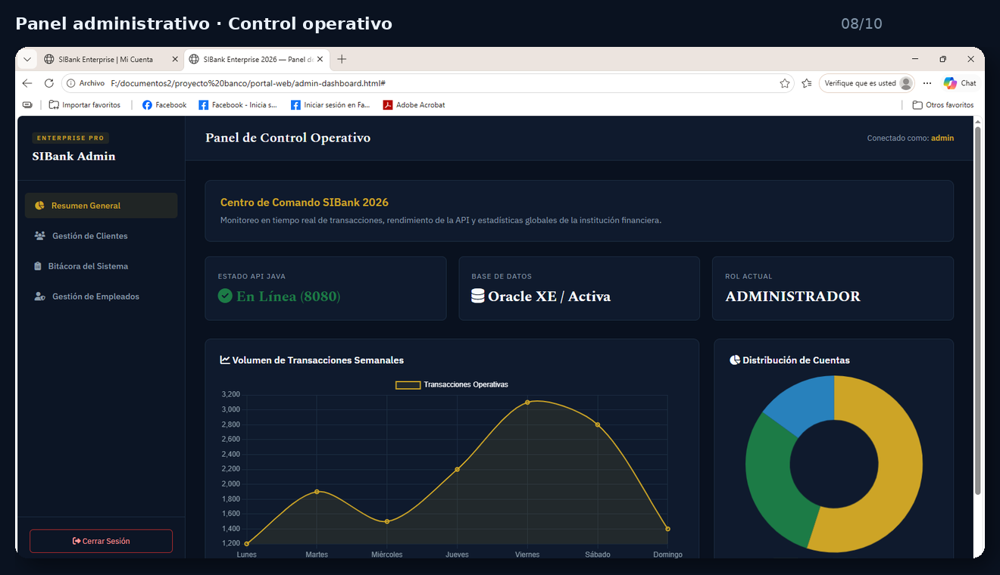
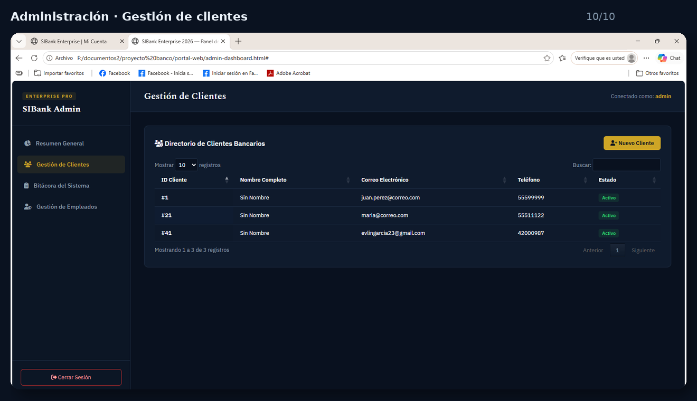

# 🏦 SIBank Enterprise 2026

<p align="center">
  
</p>

<p align="center">
  <strong>Una plataforma bancaria integral construida como proyecto de portafolio profesional.</strong><br>
  Simula la operación de una institución financiera moderna desde la base de datos hasta la experiencia del cliente.
</p>

<p align="center">
  
  
  
  
  
</p>

---

## 💡 ¿Qué es SIBank Enterprise?

**SIBank Enterprise 2026** nació como un proyecto de portafolio para llevar a un escenario práctico diferentes tecnologías que he venido trabajando y conectarlas dentro de una misma solución.

La idea no fue crear solamente una pantalla de login o un CRUD aislado, sino construir una experiencia que se sintiera como un pequeño ecosistema bancario: **datos, lógica de negocio, operaciones internas, administración y banca digital para clientes**.

El proyecto está organizado en **4 capas independientes**, lo que permite separar responsabilidades y visualizar cómo podrían comunicarse los distintos componentes de una solución empresarial.

> **Mi objetivo con SIBank:** demostrar que puedo entender un problema desde varias capas y convertirlo en una solución funcional, organizada y presentable.

---

## 🧩 Arquitectura

```text
                         ┌───────────────────────────┐
                         │      CLIENTES / USUARIOS  │
                         └─────────────┬─────────────┘
                                       │
                          ┌────────────▼────────────┐
                          │     PORTAL WEB CLIENTE  │
                          │ HTML · CSS · JS · React  │
                          └────────────┬────────────┘
                                       │ API
                          ┌────────────▼────────────┐
                          │   BACKEND / API REST    │
                          │    Java · Spring Boot   │
                          └────────────┬────────────┘
                                       │
                  ┌────────────────────┴────────────────────┐
                  │                                         │
        ┌─────────▼─────────┐                     ┌─────────▼─────────┐
        │ APLICACIÓN        │                     │ BASE DE DATOS     │
        │ DE ESCRITORIO     │                     │ Oracle · PL/SQL   │
        │ C# · WinForms     │                     │ 24 tablas + lógica│
        └───────────────────┘                     └───────────────────┘
```

### 1. 🗄️ Base de datos — Oracle

La capa de datos está construida sobre **Oracle Database** y administrada mediante **PL/SQL**.

Incluye:

- 24 tablas.
- Procedimientos almacenados.
- Paquetes.
- Triggers orientados a auditoría.
- Funciones de negocio.
- Estructura destinada a soportar las operaciones del sistema.

### 2. ⚙️ Backend — Java Spring Boot

El backend funciona como el punto central de comunicación entre las aplicaciones y los datos.

Incluye:

- API REST.
- Lógica de negocio central.
- Conexiones con la base de datos.
- Configuración CORS.
- Separación entre la lógica del sistema y las interfaces de usuario.

### 3. 🖥️ Aplicación de escritorio — C# / Windows Forms

La aplicación de escritorio está pensada para las operaciones diarias de los empleados del banco.

Fue desarrollada en **Visual Studio 2022** utilizando **C# / .NET Windows Forms**.

También incorpora componentes personalizados mediante `OnPaint` para construir parte de la experiencia visual del sistema.

### 4. 🌐 Portal web — HTML, JavaScript y React

El portal web representa la experiencia de banca digital para los clientes.

Está construido utilizando:

- HTML5.
- CSS3.
- JavaScript.
- React mediante CDN/Babel.
- Modales dinámicos.
- Estilos personalizados.

La intención fue mantener una interfaz moderna sin depender de una cadena de herramientas de compilación compleja.

---

## ✨ ¿Qué se puede ver en el proyecto?

SIBank no se queda únicamente en una pantalla principal. El proyecto incluye diferentes escenarios que permiten visualizar la operación de una plataforma bancaria.

### 🏢 Entorno interno

- Inicio de sesión para empleados.
- Operaciones bancarias.
- Emisión de tarjetas.
- Gestión de clientes.
- Gestión de préstamos.
- Bitácora de actividad.
- Analítica financiera.
- Panel administrativo.
- Gestión de usuarios.

### 👤 Entorno del cliente

- Inicio de sesión de banca digital.
- Consulta de cuenta.
- Transferencias.
- Solicitud de productos/servicios.
- Interfaz orientada al usuario final.

---

# 🖼️ Galería del sistema

Las capturas fueron organizadas y presentadas nuevamente para que sea más fácil apreciar la interfaz directamente desde GitHub.

## 📊 Analítica financiera

<p align="center">
  
</p>

El módulo de analítica presenta información financiera en una interfaz orientada a la lectura rápida y al seguimiento de indicadores.

---

## 💳 Operaciones bancarias

<p align="center">
  
</p>

Una de las operaciones representadas dentro del sistema es la emisión de tarjetas desde la aplicación de escritorio.

---

## 👥 Gestión de clientes y operaciones

<p align="center">
  
</p>

El sistema incorpora pantallas orientadas a la administración de información de clientes y solicitudes.

---

## 🔎 Auditoría y bitácora

<p align="center">
  
</p>

La bitácora permite visualizar la actividad registrada dentro del entorno operativo.

---

## 🌐 Portal de banca digital

<p align="center">
  
</p>

El portal web busca trasladar la experiencia del sistema a una interfaz pensada para el cliente final.

---

## 💸 Transferencias

<p align="center">
  
</p>

El flujo de transferencia se presenta mediante un formulario/modal enfocado en mantener la operación clara para el usuario.

---

## 🛠️ Panel administrativo

<p align="center">
  
</p>

El panel administrativo reúne información operativa y elementos de monitoreo en una sola vista.

---

## 👨‍💻 Gestión de clientes

<p align="center">
  
</p>

La administración de clientes permite visualizar la información registrada desde una interfaz dedicada.

---

# 🧰 Tecnologías utilizadas

| Capa | Tecnología |
|---|---|
| Base de datos | **Oracle Database / PL/SQL** |
| Backend | **Java / Spring Boot** |
| Aplicación de escritorio | **C# / .NET Windows Forms** |
| IDE escritorio | **Visual Studio 2022** |
| IDE backend | **NetBeans** |
| Frontend | **HTML5 / CSS3 / JavaScript** |
| UI web | **React vía CDN/Babel** |
| Gestión de BD | **SQL Developer** |

---

# 🎯 ¿Qué demuestra este proyecto?

Más allá de las tecnologías, este proyecto representa una forma de trabajar:

- 🧱 **Arquitectura por capas:** separación de responsabilidades.
- 🔄 **Integración:** diferentes tecnologías trabajando dentro de una misma solución.
- 🗃️ **Manejo de datos:** modelado y lógica en Oracle/PLSQL.
- 🔌 **APIs:** comunicación mediante un backend REST.
- 🖥️ **Aplicaciones de escritorio:** desarrollo de interfaces para operaciones internas.
- 🌐 **Desarrollo web:** construcción de una experiencia de banca digital.
- 📋 **Operaciones empresariales:** administración, clientes, préstamos, tarjetas y auditoría.
- 🎨 **Presentación:** cuidado de la interfaz para que el sistema no sea solamente funcional, sino también agradable de utilizar.

---

# 🚀 Cómo visualizar el proyecto

El proyecto está compuesto por varias capas, por lo que su ejecución depende de la configuración de **Oracle Database**, el **backend Spring Boot**, la aplicación **Windows Forms** y el **portal web**.

La estructura recomendada para trabajar con el proyecto es:

```text
SIBank Enterprise 2026/
│
├── database/
│   └── Oracle · PL/SQL
│
├── backend/
│   └── Java · Spring Boot
│
├── desktop/
│   └── C# · Windows Forms
│
├── web/
│   └── HTML · CSS · JavaScript · React
│
└── docs/
    └── screenshots/
```

> Los nombres de carpetas anteriores representan la separación conceptual de las capas. Adáptalos a la estructura real de tu repositorio antes de publicar esta sección si tus carpetas tienen otros nombres.

---

# 🔐 Credenciales de demostración

> ⚠️ **Importante:** estas credenciales corresponden al entorno de demostración incluido en el proyecto. No deben utilizarse en producción ni reutilizarse en otros sistemas.

<details>
<summary><strong>Ver credenciales de prueba</strong></summary>

### Oracle — Schema

```text
Usuario: siban
Contraseña: sibank123
```

### Sistema de escritorio / API

```text
Usuario: admin
Contraseña: Admin123!
```

### Portal web — Cliente de prueba

```text
Usuario: juanperez
Contraseña: Cliente123!
```

</details>

---

# 📌 Estado del proyecto

**SIBank Enterprise 2026** es un proyecto de portafolio y simulación de una plataforma bancaria.

La finalidad principal es demostrar conocimientos de desarrollo de software, integración de tecnologías, bases de datos, aplicaciones de escritorio, APIs y desarrollo web dentro de un mismo proyecto.

---

# 🔭 Próximos pasos

Algunas áreas que pueden seguir evolucionando a partir de esta base son:

- Mejorar y ampliar la cobertura de pruebas.
- Fortalecer la gestión de configuración y secretos.
- Añadir documentación técnica de endpoints y base de datos.
- Incorporar despliegues automatizados.
- Continuar refinando la experiencia de usuario.
- Ampliar los módulos bancarios y los escenarios de negocio.

---

# 🤝 Colaboraciones

Este proyecto también puede servir como punto de partida para experimentar con nuevas ideas, integraciones y mejoras.

Si te interesa **probar el proyecto, aportar una idea, proponer una mejora o explorar una colaboración**, puedes abrir un Issue o Pull Request en este repositorio.

---

# 👨‍💻 Sobre el proyecto

**SIBank Enterprise 2026** es un proyecto que desarrollé para seguir llevando mis conocimientos de programación a escenarios más cercanos a los que se encuentran en sistemas empresariales reales.

Mi intención es seguir construyendo proyectos donde no solamente importe que el código funcione, sino también **cómo se estructura, cómo se integra y cómo se presenta el producto final**.

---

<p align="center">
  <strong>Construir. Integrar. Aprender. Mejorar.</strong>
</p>

<p align="center">
  <sub>SIBank Enterprise 2026 · Proyecto de portafolio</sub>
</p>
